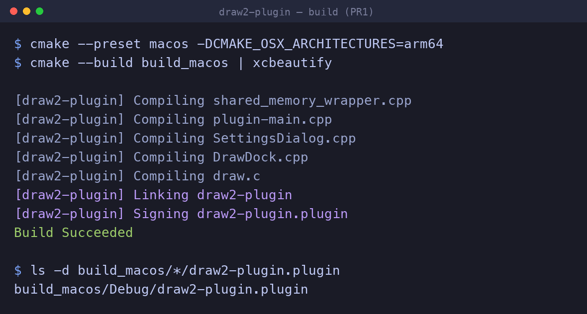
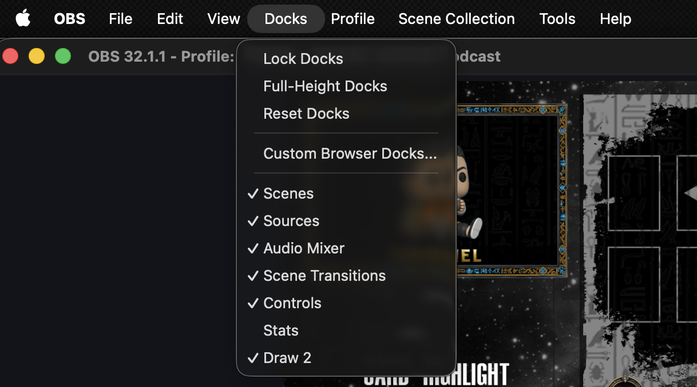
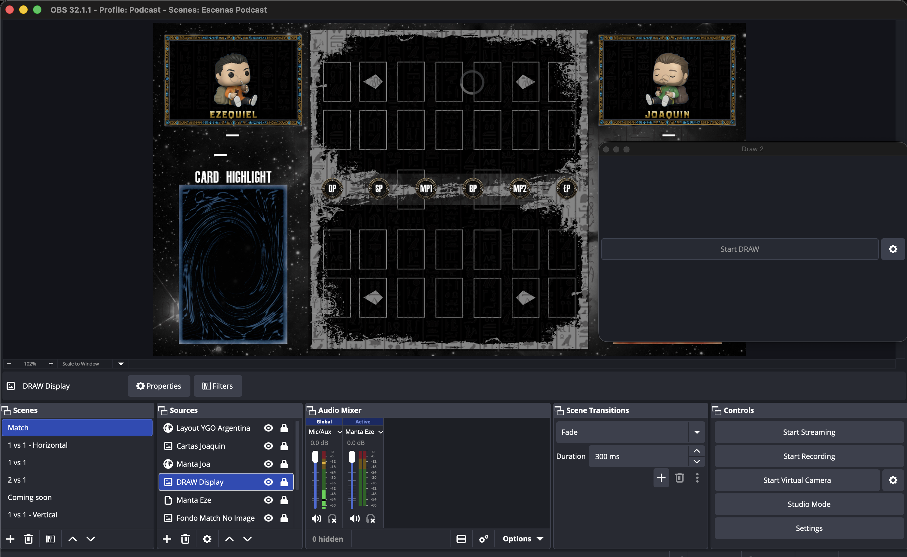

# build(macos): fix macOS 26 / Xcode 16 build (AGL, AUTOMOC predefines)

## Summary

Fixes two macOS build failures that prevent the plugin from compiling on a
current toolchain (macOS 26 SDK, Xcode 16+ / clang 17+). Both are
build-system only and independent of the plugin's runtime behavior — the
plugin still embeds libpython exactly as before.

## Motivation

On a clean checkout, `cmake --preset macos` + build fails twice:

1. **`ld: framework 'AGL' not found`.** `AGL.framework` was removed from the
   macOS 26 SDK, but Qt's `FindWrapOpenGL` still adds it to the OpenGL link
   interface (pulled in transitively by `Qt6::Gui`). The plugin does not use
   AGL, so the reference is spurious — but it breaks linking.
2. **`conflicting deployment targets`.** Qt's AUTOMOC generates
   `moc_predefs.h` by invoking the compiler with no explicit deployment
   target. On Xcode 16+ / clang 17+ the build environment exports several
   `*_DEPLOYMENT_TARGET` variables at once, which clang rejects.

## Changes

`CMakeLists.txt`, inside the existing `if(ENABLE_QT)` block, both guarded by
`if(APPLE)` so non-macOS builds are untouched:

- Strip `AGL` from `WrapOpenGL::WrapOpenGL`'s `INTERFACE_LINK_LIBRARIES`.
- Set `AUTOMOC_COMPILER_PREDEFINES OFF` (the predefines are not needed here).

No source files change; no behavior change.

## Scope / risk

- macOS-only (everything is under `if(APPLE)`); Windows/Linux builds are
  byte-for-byte unaffected.
- The plugin's Python integration is unchanged (still embedded libpython).
- Lowest-risk possible change: build configuration only.

## How it was tested

Environment: macOS 26 (Apple Silicon), Xcode 16+ / clang 17+, OBS Studio 32.1.1.

**Build from source** — `cmake --preset macos -DCMAKE_OSX_ARCHITECTURES=arm64`
then `cmake --build build_macos` → **build succeeds** and produces
`build_macos/<config>/draw2-plugin.plugin`. (On `master` the same build fails
at link with `ld: framework 'AGL' not found`.)

**Loads in OBS** — the bundle was copied into the OBS plugins folder; OBS
launches cleanly and registers the dock: **`Draw 2`** appears (checked) in the
`Docks` menu.

**Dock opens** — activating it shows the `Draw 2` dock (with the `Start DRAW`
control) docked alongside the scene.

**Cross-platform:** Windows and Linux are unaffected — every change is inside
`if(APPLE)`, so their CMake configuration is identical to `master`. <!-- TODO: link the 3-platform CI run once green -->

<!-- When opening the PR on GitHub, drag the three files from
docs/pr/01-macos-build-fix/screenshots/ into the description so GitHub hosts
them; the relative paths above are for the in-repo copy. -->

## Notes for reviewers

- Apple Silicon: build `arm64`-only (`-DCMAKE_OSX_ARCHITECTURES=arm64`).
  Homebrew's `libpython` is `arm64`-only, so a universal build would fail to
  link the `x86_64` slice — unrelated to this fix, and resolved separately
  when the backend stops embedding libpython.
